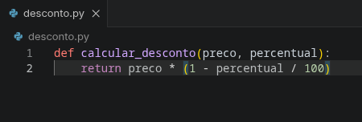
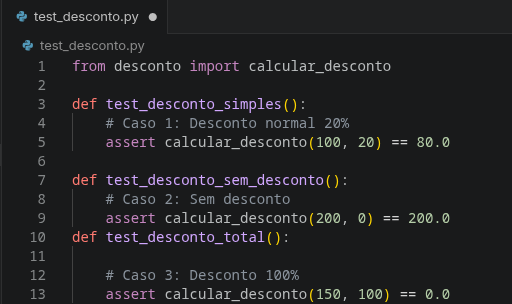
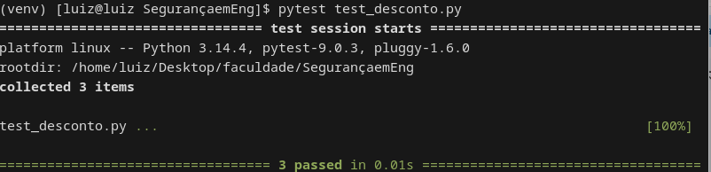

# 🧪 Testes Unitários em Python com Pytest

Este projeto demonstra a criação e execução de **testes unitários** em Python utilizando a biblioteca `pytest`, com foco na validação de uma função de cálculo de desconto.

---

## 📌 Objetivo

O objetivo é garantir que a função `calcular_desconto` funcione corretamente em diferentes cenários, aplicando boas práticas de testes automatizados.

---

## ⚙️ Funcionalidade

A função recebe:

* `preco`: valor original do produto
* `percentual`: percentual de desconto

E retorna o valor final com desconto aplicado.

### 📊 Exemplo:

```python
calcular_desconto(100, 20)  # Resultado: 80.0
```

---

## 📁 Estrutura do Projeto

```
.
├── desconto.py
├── test_desconto.py
└── README.md
```

---

## 🧠 Implementação

### Arquivo: `desconto.py`

```python
def calcular_desconto(preco, percentual):
    return preco * (1 - percentual / 100)
```

---

### Arquivo: `test_desconto.py`

```python
from desconto import calcular_desconto

def test_desconto_simples():
    assert calcular_desconto(100, 20) == 80.0

def test_sem_desconto():
    assert calcular_desconto(200, 0) == 200.0

def test_desconto_total():
    assert calcular_desconto(150, 100) == 0.0
```

---

## ▶️ Como executar

### 1. Instalar dependências

```bash
pip install pytest
```

---

### 2. Executar os testes

```bash
pytest
```

---

## 📷 Resultado esperado

Ao executar o comando, o terminal deve exibir algo semelhante a:


---

## ✅ Boas práticas aplicadas

* Testes independentes
* Nomes descritivos
* Uso de `assert` para validação
* Cobertura de casos:

  * desconto normal
  * sem desconto
  * desconto total

---

## 🎯 Conclusão

Os testes unitários permitem validar o comportamento do código de forma automatizada, reduzindo erros e aumentando a confiabilidade do sistema.

---

## 👨‍💻 Autor

Luiz Whoami
